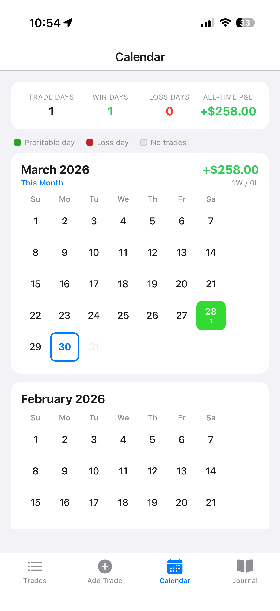
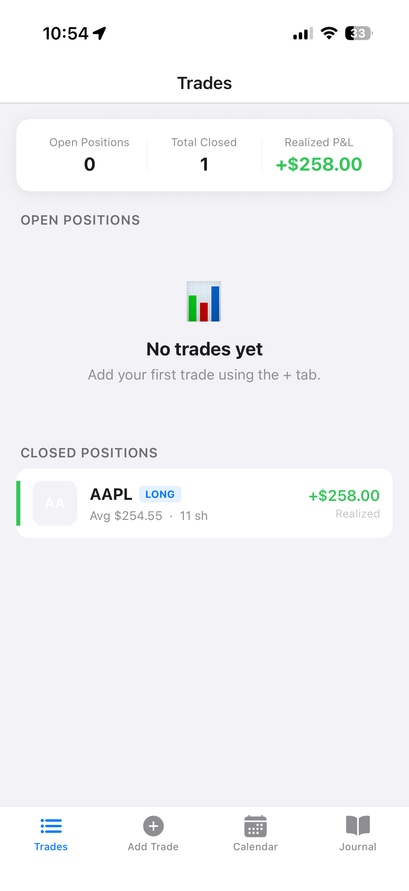

# TradeJournal

> *A mobile-first trade journal for traders who want to understand their edge — not just track their trades.*

TradeJournal is a cross-platform iOS/Android app built with React Native and Expo. It starts as a clean, fast way to log trades manually, and grows into a personal trading analytics engine with AI-powered plan analysis.

---

## Screenshots

<p align="center">
  
  
  
 
</p>

---

## Why This Exists

Most trading journals are either desktop-only, spreadsheet-based, or buried inside a brokerage app. None of them feel like something you'd actually reach for on your phone mid-session. TradeJournal is built mobile-first, works fully offline, and is designed to grow with the trader — from manual logging in week one, to AI-assisted trade planning, to a full web portal with automatic trade import from your brokerage.

---

## Features

**Phase 1 — MVP**

| Feature | Status |
|---|---|
| Manual trade logging (ticker, type, entry/exit, qty, strategy, notes) | ✅ Built |
| Trade grade (A/B/C/D) — execution quality separate from P&L | ✅ Built |
| Emotion tag (Confident / FOMO / Hesitant / Revenge / Bored / Patient) | ✅ Built |
| Setup notes (pre-trade) + review notes (post-trade) | ✅ Built |
| Market data auto-fill via Yahoo Finance + company logo via FMP | ✅ Built |
| Multiple entries per position (adding to an open trade) | ✅ Built |
| Trade log + detail views | ✅ Built |
| Predefined strategy list + custom strategy creation | ✅ Built |
| Offline-first local storage (SQLite) | ✅ Built |

**Phase 2 — Analytics & Cloud**

| Feature | Status |
|---|---|
| Weekly & monthly performance summaries | 📋 Planned |
| Strategy insights (win rate, P&L by strategy, avg win/loss) | 📋 Planned |
| Time-of-day analytics | 📋 Planned |
| Emotion tag insights ("Your FOMO trades return -4.2% on average") | 📋 Planned |
| Performance charts & dashboard | 📋 Planned |
| Chart screenshot attachment (upload to cloud) | 📋 Planned |
| Daily journal (market conditions + mindset notes) | 📋 Planned |
| CSV + PDF export | 📋 Planned |
| Cloud sync + user auth (Supabase) | 📋 Planned |

**Phase 3 — AI Analysis**

| Feature | Status |
|---|---|
| Trade plan builder | 📋 Planned |
| Historical analysis of proposed trades | 📋 Planned |
| AI-powered trade proposal analysis | 📋 Planned |

**Phase 4 — Web Portal**

| Feature | Status |
|---|---|
| Next.js web app (shared Supabase backend) | 📋 Planned |
| Richer dashboard — charts, tables, bulk edit | 📋 Planned |
| Shared API layer (mobile + web consume same endpoints) | 📋 Planned |

**Phase 5 — Broker Integrations**

| Feature | Status |
|---|---|
| Alpaca integration — auto-import executed trades | 📋 Planned |
| Interactive Brokers (IBKR) integration | 📋 Planned |
| Schwab / TD Ameritrade integration | 📋 Planned |
| Real-time P&L on open positions | 📋 Planned |

---

## Tech Stack

| Layer | Choice | Why |
|---|---|---|
| Framework | React Native + Expo | Write once, run on iOS and Android. Expo's managed workflow removes native config overhead and enables OTA updates. |
| Language | TypeScript | Financial data — prices, quantities, P&L calculations — demands type safety at compile time. |
| Local DB | SQLite + Drizzle ORM | Offline-first MVP with no login friction. Drizzle's type-safe migrations make the later move to cloud non-destructive. |
| Cloud DB | Supabase (Phase 2+) | PostgreSQL for analytical queries, Edge Functions for AI, generous free tier, open source. |
| Market data | Yahoo Finance + FMP | Auto-fill company name on ticker entry, logo via Financial Modeling Prep symbol images. No API key required. |
| AI layer | Supabase Edge Functions (Phase 3) | API keys stay server-side, models are swappable without an app update, rate limiting is straightforward. |

**Why React Native over Flutter?** The JS/TS ecosystem has significantly better financial library coverage. Expo's managed workflow means less time fighting native toolchains and more time building product. TypeScript is shared across the entire stack.

---

## Getting Started

```bash
# Prerequisites: Node.js 18+, Expo CLI, iOS Simulator (Xcode) or Android Emulator

# Clone the repo
git clone https://github.com/srikanth68/TradeJournal.git
cd TradeJournal

# Install dependencies
npm install

# Start the dev server
npx expo start

# Run on iOS simulator
npx expo run:ios
```

---

## Project Structure

```
TradeJournal/
├── app/                        # Expo Router screens
│   ├── (tabs)/
│   │   ├── _layout.tsx         # Tab bar (Trades / Add Trade / Calendar / Journal)
│   │   ├── index.tsx           # Trade Log screen
│   │   ├── add.tsx             # Add Trade form
│   │   ├── calendar.tsx        # Monthly P&L heat-map calendar
│   │   ├── coach.tsx           # AI Coach (hidden, Phase 2)
│   │   └── journal.tsx         # Daily Journal (placeholder)
│   ├── position/
│   │   └── [id].tsx            # Position Detail screen
│   └── _layout.tsx             # Root layout (migrations + seed)
├── src/
│   ├── components/
│   │   └── StrategyPickerModal.tsx
│   ├── db/
│   │   ├── schema.ts           # Drizzle ORM schema + relations
│   │   ├── index.ts            # DB instance + DDL migrations
│   │   └── seed.ts             # Predefined strategy seed
│   ├── services/
│   │   ├── positionService.ts  # All position/entry DB operations
│   │   ├── tickerService.ts    # Yahoo Finance + FMP logo, session cache
│   │   └── coachService.ts     # AI Coach via Claude API (Phase 2)
│   └── utils/
│       └── price.ts            # Price integer storage utilities
├── docs/                       # Project documentation
├── drizzle.config.ts
└── README.md
```

---

## Documentation

- [Requirements](docs/requirements.md) — Full product requirements by phase
- [Architecture Decisions](docs/architecture-decisions.md) — ADRs covering every major technical choice
- [Prompts & AI Collaboration](docs/prompts.md) — How this project was built with AI assistance

---

## Roadmap

**Phase 1 — MVP ✅ Complete**
Offline trade logging. Core data model. Add trade form with Yahoo Finance auto-fill + FMP company logos. Strategy picker modal (predefined + custom). Trade grade + emotion tag. Full trade log and position detail views with Add Entry, Close Position, and Edit modals. P&L calendar heat-map.

**Phase 2 — Analytics & Cloud**
Cloud sync + auth. Weekly/monthly summaries. Strategy and emotion tag insights. Charts and dashboard. Chart screenshot attachment. Daily journal. CSV + PDF export.

**Phase 3 — AI Analysis**
Trade plan builder. Historical performance matching. AI model analysis of trade proposals via Supabase Edge Functions.

**Phase 4 — Web Portal**
Next.js web app sharing the same backend. Richer dashboard and analytics. Shared API layer — both mobile and web consume the same endpoints, no logic duplication.

**Phase 5 — Broker Integrations**
OAuth connections to Alpaca, Interactive Brokers, and Schwab. Automatic trade import. Real-time P&L on open positions.

---

## License

MIT

---

*Built as a portfolio project and personal tool — a real app solving a real problem, with a real roadmap.*
